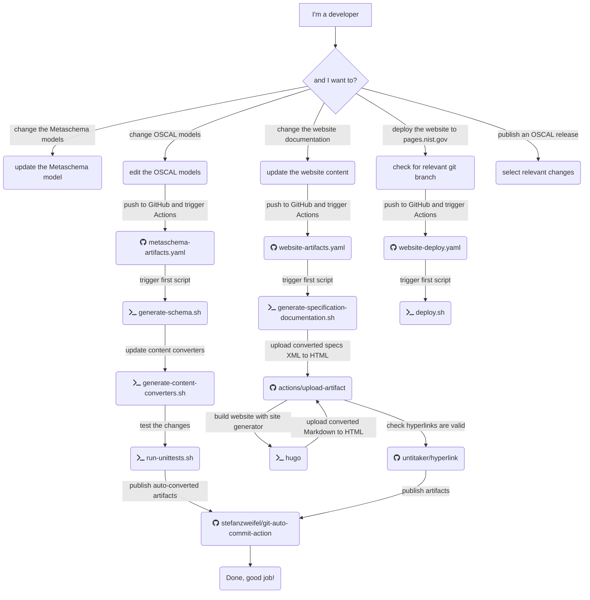

# Continuous Integration and Continuous Deployment (CI/CD)

This GitHub repository uses a CI/CD process that provides automation for:

- Validation of contributed content and models.
- Generation of documentation, content converters, and content in alternate formats.
- Methods to update the [project website](https://pages.nist.gov/OSCAL).

Using a CI/CD process ensures that all artifacts in [pull requests](https://github.com/usnistgov/OSCAL/blob/master/CONTRIBUTING.md) and in the [master branch](https://github.com/usnistgov/OSCAL) are valid and usable.

## Workflow

The NIST OSCAL repository provide scripts and orchestrates them through [GitHub Actions job declarations]. Below is a diagram illustrating the tasks an OSCAL stakeholder will want to perform and the relevant GitHub Actions jobs and scripts they trigger.



## Provided Scripts and Tools

The following scripts and tools in this repository and its submodules are itemized below. 

1. [run-all.sh](run-all.sh): Runs all of the scripts in workflow order.
1. [validate-metaschema.sh](validate-metaschema.sh): Ensures that all [metaschema](https://github.com/usnistgov/OSCAL/tree/master/src/metaschema) are valid according to the [metaschema XML schema](https://github.com/usnistgov/metaschema/blob/main/schema/xml/metaschema.xsd).
1. [generate-schema.sh](generate-schema.sh): Generates [XML schema](https://github.com/usnistgov/OSCAL/tree/master/xml/schema) and [JSON schema](https://github.com/usnistgov/OSCAL/tree/master/json/schema) files for each OSCAL model based on their [respective metaschemas](https://github.com/usnistgov/OSCAL/tree/master/src/metaschema).
1. [validate-content.sh](validate-content.sh): Validates OSCAL content in the repository's [src](https://github.com/usnistgov/OSCAL/tree/master/src) against the content's respective OSCAL model and format.
1. [generate-content-converters.sh](generate-content-converters.sh): Generates [JSON to XML](https://github.com/usnistgov/OSCAL/tree/master/xml/convert) and [XML to JSON](https://github.com/usnistgov/OSCAL/tree/master/json/convert) content conversion scripts for each OSCAL model based on their [respective metaschemas](https://github.com/usnistgov/OSCAL/tree/master/src/metaschema).
1. [copy-and-convert-content.sh](copy-and-convert-content.sh): Copies selective content from the [src/content](https://github.com/usnistgov/OSCAL/tree/master/src/content) directory, and generates instance of this content in alternate OSCAL formats using the appropriate content converters. Note __This script requires that the process have write access to the Git repository branch that the CI/CD is operating on to work completely.__
1. [validate-content-conversion-round-trips.sh](validate-content-conversion-round-trips.sh): Performs round trip validations of the content from XML->JSON->XML to confirm that the conversions are lossless and that resulting files comply with their schemas.

    Additional scripts are provided that generate content for the OSCAL project website, supported by the GitHub Actions ```build``` workflow on the ```master``` branch.

1. [generate-model-documentation.sh](generate-model-documentation.sh): This is used as part of the site generation pipeline to build HTML documentation for the OSCAL models.

Not every script above is run with every pull request as part of the CI/CD system. Some are only for local development and testing. Please review the [../../.github/workflows](GitHub Actions workflows) for current inventory of what is used for CI and CD for every pull request.

## Running the Scripts Locally

The bash scripts used in the CI/CD workflow can be run locally in the correct environment. In addition to a bash shell, to run these scripts the following must be installed:

- [xmlint](https://linux.die.net/man/1/xmllint/)
- Java 11 or greater
- [Apache Maven](https://maven.apache.org/) 3.6.1 or greater
- [Node.js and Node Package Manager (NPM)](https://nodejs.org/en/) 10.15.3 or greater
- 'Another Json Validator' Command Line Interface ([ajv-cli](https://github.com/jessedc/ajv-cli)) v3.0.0 or greater
- [Python](https://www.python.org/) tested with 3.7.3

Additionally, the following packages need to be installed.

NodeJS Packages:

```bash
npm install -g ajv-cli
```

Python Packages:

```bash
pip install lxml
```

The Saxon jar file needs to be retrieved. This can be two ways:

1. You can set the environment variable ```SAXON_VERSION``` to the Saxon version to use. This must correspond to a valid Saxon-HE version in [Maven Central](https://search.maven.org/artifact/net.sf.saxon/Saxon-HE). Maven will be used to automatically download the Saxon-HE jar dependency.

    For example:

    ```bash
    export SAXON_VERSION=10.6
    ```

2. You can manually download any variant of Saxon (e.g., HE, ) from [Saxonica](https://www.saxonica.com/download/java.xml) and set the ```SAXON_HOME``` environment variable to the location of the Saxon JAR.

```bash
export SAXON_HOME=~/saxon-jar-directory
```

Finally, the Schematron Skeleton needs to be retrieved. The following commands can be used to download it.

```bash
export SCHEMATRON_HOME=~/schematron-skeleton
git clone --depth 1 --no-checkout https://github.com/Schematron/schematron.git "$SCHEMATRON_HOME"
cd "$SCHEMATRON_HOME"
git checkout master -- trunk/schematron/code
```

### Further installation notes

Setting up to run in WSL (Windows subsystem for Linux) avoids many Windows-related configuration issues, but requires the entire environment be available from within the subsystem. The easiest way to accomplish this is to install the components into the subsystem directly.

To check whether xmllint is installed:

```bash
xmllint -version
```

To install it

```bash
sudo apt install libxml2-utils
```

To install Java:

```bash
sudo apt install openjdk-11-jre-headless
```

To install NodeJS:

```bash
sudo apt install nodejs
```

And npm (Node package manager, separate from NodeJS):

```bash
sudo apt install npm
```

To install AJV (nodeJS JSON validator)

```bash
npm install -g ajv-cli
```

or if you want to install globally (for all users):

```bash
sudo npm install -g ajv-cli
```

Ubuntu comes with Python. To check the version:

```bash
python3 -V
```

Scripts were tested with version 3.7.3 but 3.6.8 (the default in Ubuntu under WSL) should work.

Along with Python you also need a library, for which you need pip (a Python installer):

```bash
sudo apt install python-pip
pip install lxml

```

To install Maven:

```bash
sudo apt install maven
```

Then run Maven to acquire Saxon:

```bash
export SAXON_VERSION=10.6
mvn org.apache.maven.plugins:maven-dependency-plugin:2.10:get -DartifactId=Saxon-HE -DgroupId=net.sf.saxon -Dversion=$SAXON_VERSION
```

You will also need a copy of the ISO Schematron skeleton.

```bash
mkdir $HOME/oscal-oss
export SCHEMATRON_HOME=$HOME/oscal-oss/git-schematron
git clone --depth 1 --no-checkout https://github.com/Schematron/schematron.git "$SCHEMATRON_HOME"
cd "$SCHEMATRON_HOME"
git checkout master -- trunk/schematron/code
```

Finally, export instructions in the preceding must also be copied into .bashrc so they persist in your environment.

prettyson

```bash
sudo npm install -g prettyjson
```

jq

```bash
sudo apt-get install jq
```
