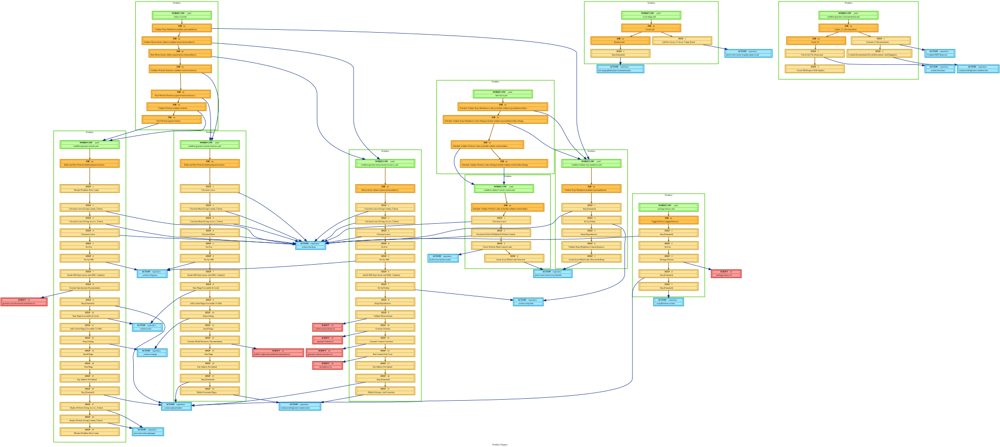
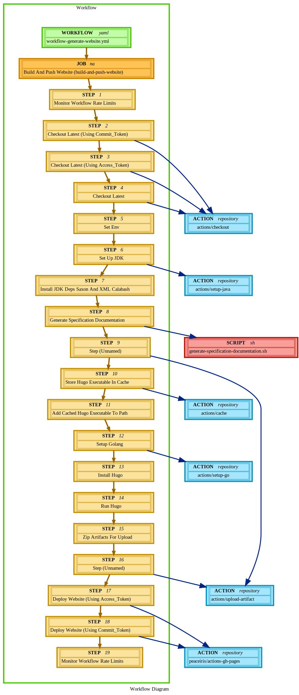
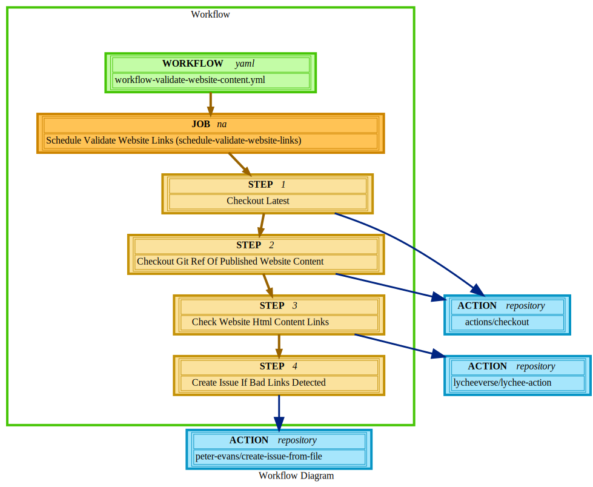
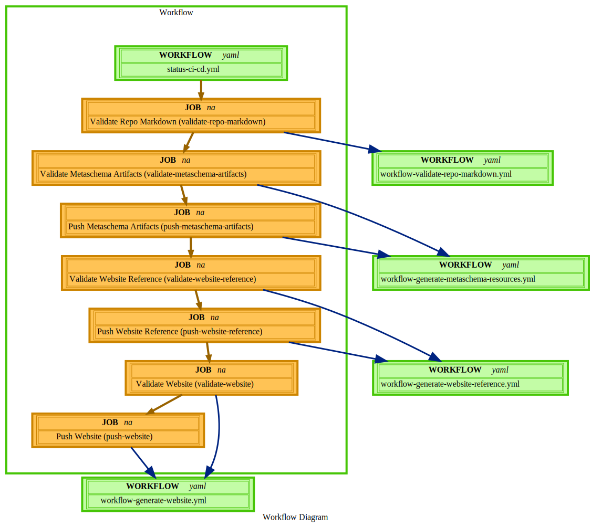
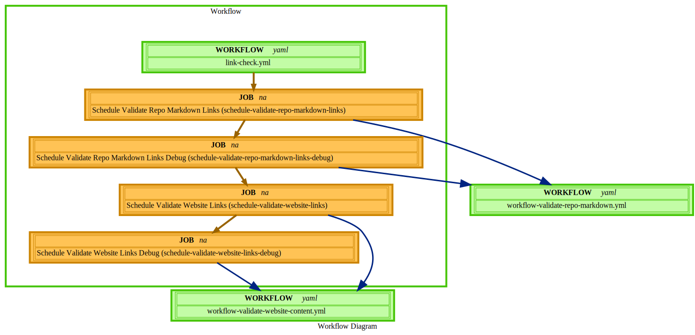
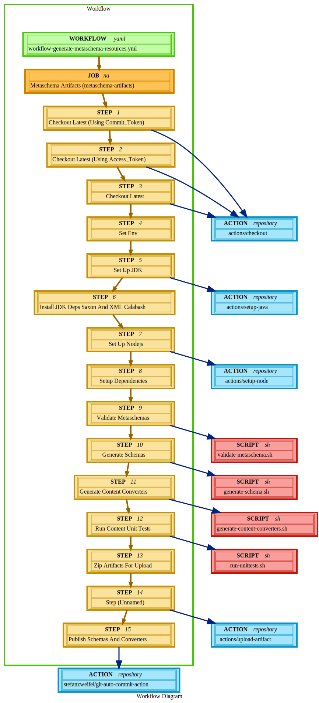
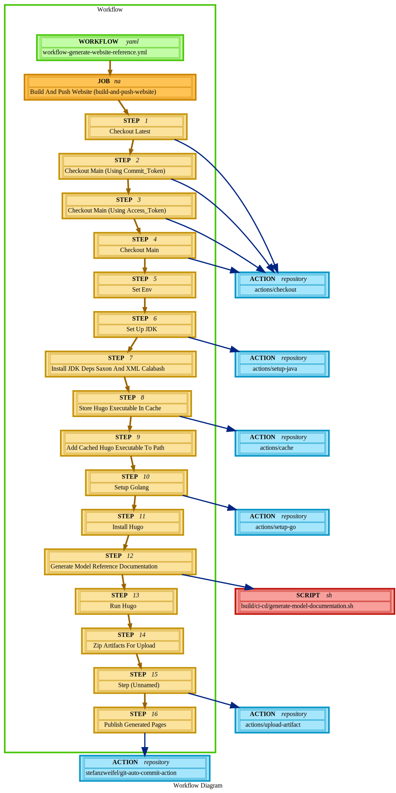
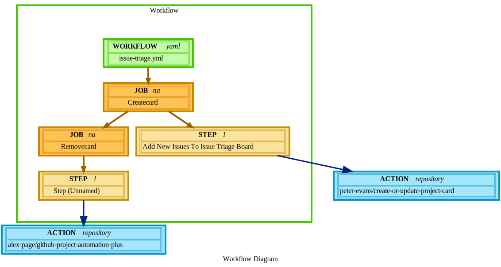
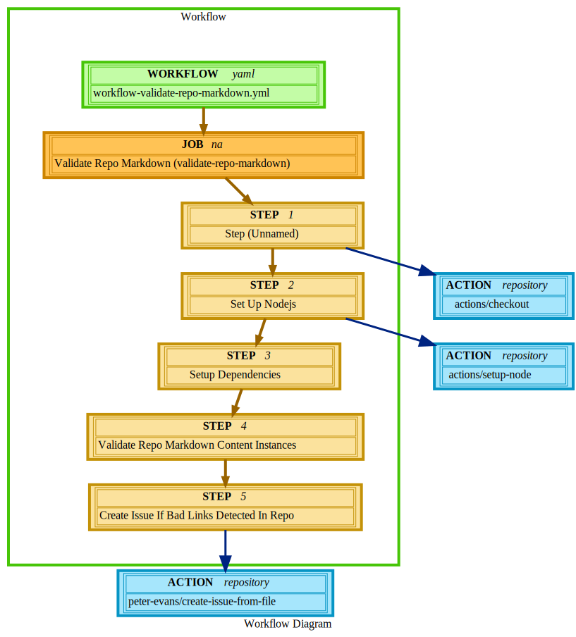
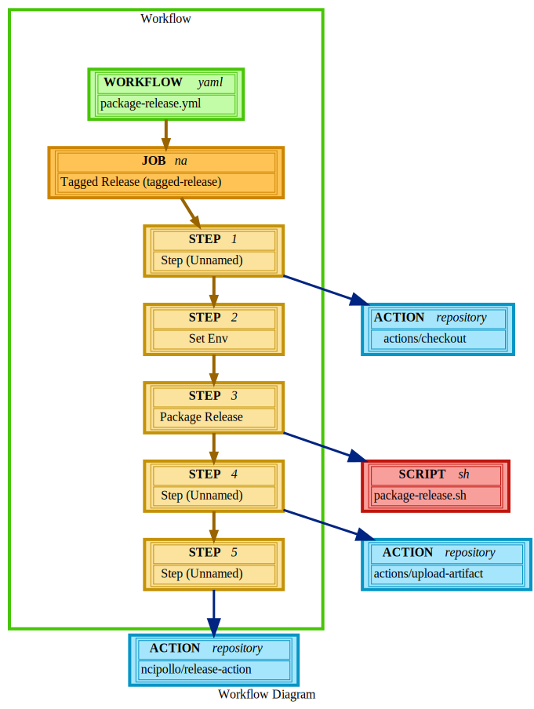

## Repository Overview Diagram

---

# Table of Contents:

- [Generate Website (workflow-generate-website.yml)](#workflow-generate-website-workflow-generate-websiteyml)

- [Validate Website Content (workflow-validate-website-content.yml)](#workflow-validate-website-content-workflow-validate-website-contentyml)

- [OSCAL CI/CD (status-ci-cd.yml)](#workflow-oscal-ci/cd-status-ci-cdyml)

- [Link Check (link-check.yml)](#workflow-link-check-link-checkyml)

- [Generate Model Resources (workflow-generate-metaschema-resources.yml)](#workflow-generate-model-resources-workflow-generate-metaschema-resourcesyml)

- [Generate Reference Docs (workflow-generate-website-reference.yml)](#workflow-generate-reference-docs-workflow-generate-website-referenceyml)

- [Triage Board Management (issue-triage.yml)](#workflow-triage-board-management-issue-triageyml)

- [Generate CI Documentation (workflow-generate-ci-documentation.yml)](#workflow-generate-ci-documentation-workflow-generate-ci-documentationyml)

- [Validate Repo Markdown (workflow-validate-repo-markdown.yml)](#workflow-validate-repo-markdown-workflow-validate-repo-markdownyml)

- [Package Release (package-release.yml)](#workflow-package-release-package-releaseyml)

# Workflows:

## Workflow: Generate Website (workflow-generate-website.yml)

- Job: Build And Push Website (build-and-push-website)
	- Step 1: Monitor Workflow Rate Limits
	- Step 2: Checkout Latest (Using Commit_Token)
		- Uses: actions/checkout
	- Step 3: Checkout Latest (Using Access_Token)
		- Uses: actions/checkout
	- Step 4: Checkout Latest
		- Uses: actions/checkout
	- Step 5: Set Env
	- Step 6: Set Up JDK
		- Uses: actions/setup-java
	- Step 7: Install JDK Deps Saxon And XML Calabash
	- Step 8: Generate Specification Documentation
		- Script: `generate-specification-documentation.sh`
	- Step 9:
		- Uses: actions/upload-artifact
	- Step 10: Store Hugo Executable In Cache
		- Uses: actions/cache
	- Step 11: Add Cached Hugo Executable To Path
	- Step 12: Setup Golang
		- Uses: actions/setup-go
	- Step 13: Install Hugo
	- Step 14: Run Hugo
	- Step 15: Zip Artifacts For Upload
	- Step 16:
		- Uses: actions/upload-artifact
	- Step 17: Deploy Website (Using Access_Token)
		- Uses: peaceiris/actions-gh-pages
	- Step 18: Deploy Website (Using Commit_Token)
		- Uses: peaceiris/actions-gh-pages
	- Step 19: Monitor Workflow Rate Limits

### Workflow Overview

---

[Top](#table-of-contents)

## Workflow: Validate Website Content (workflow-validate-website-content.yml)

- Job: Schedule Validate Website Links (schedule-validate-website-links)
	- Step 1: Checkout Latest
		- Uses: actions/checkout
	- Step 2: Checkout Git Ref Of Published Website Content
		- Uses: actions/checkout
	- Step 3: Check Website Html Content Links
		- Uses: lycheeverse/lychee-action
	- Step 4: Create Issue If Bad Links Detected
		- Uses: peter-evans/create-issue-from-file

### Workflow Overview

---

[Top](#table-of-contents)

## Workflow: OSCAL CI/CD (status-ci-cd.yml)

- Job: Validate Repo Markdown (validate-repo-markdown)
	- Uses: workflow-validate-repo-markdown.yml
- Job: Validate Metaschema Artifacts (validate-metaschema-artifacts)
	- Uses: workflow-generate-metaschema-resources.yml
- Job: Push Metaschema Artifacts (push-metaschema-artifacts)
	- Uses: workflow-generate-metaschema-resources.yml
- Job: Validate Website Reference (validate-website-reference)
	- Uses: workflow-generate-website-reference.yml
- Job: Push Website Reference (push-website-reference)
	- Uses: workflow-generate-website-reference.yml
- Job: Validate Website (validate-website)
	- Uses: workflow-generate-website.yml
- Job: Push Website (push-website)
	- Uses: workflow-generate-website.yml

### Workflow Overview

---

[Top](#table-of-contents)

## Workflow: Link Check (link-check.yml)

- Job: Schedule Validate Repo Markdown Links (schedule-validate-repo-markdown-links)
	- Uses: workflow-validate-repo-markdown.yml
- Job: Schedule Validate Repo Markdown Links Debug (schedule-validate-repo-markdown-links-debug)
	- Uses: workflow-validate-repo-markdown.yml
- Job: Schedule Validate Website Links (schedule-validate-website-links)
	- Uses: workflow-validate-website-content.yml
- Job: Schedule Validate Website Links Debug (schedule-validate-website-links-debug)
	- Uses: workflow-validate-website-content.yml

### Workflow Overview

---

[Top](#table-of-contents)

## Workflow: Generate Model Resources (workflow-generate-metaschema-resources.yml)

- Job: Metaschema Artifacts (metaschema-artifacts)
	- Step 1: Checkout Latest (Using Commit_Token)
		- Uses: actions/checkout
	- Step 2: Checkout Latest (Using Access_Token)
		- Uses: actions/checkout
	- Step 3: Checkout Latest
		- Uses: actions/checkout
	- Step 4: Set Env
	- Step 5: Set Up JDK
		- Uses: actions/setup-java
	- Step 6: Install JDK Deps Saxon And XML Calabash
	- Step 7: Set Up Nodejs
		- Uses: actions/setup-node
	- Step 8: Setup Dependencies
	- Step 9: Validate Metaschemas
		- Script: `validate-metaschema.sh`
	- Step 10: Generate Schemas
		- Script: `generate-schema.sh`
	- Step 11: Generate Content Converters
		- Script: `generate-content-converters.sh`
	- Step 12: Run Content Unit Tests
		- Script: `run-unittests.sh`
	- Step 13: Zip Artifacts For Upload
	- Step 14:
		- Uses: actions/upload-artifact
	- Step 15: Publish Schemas And Converters
		- Uses: stefanzweifel/git-auto-commit-action

### Workflow Overview

---

[Top](#table-of-contents)

## Workflow: Generate Reference Docs (workflow-generate-website-reference.yml)

- Job: Build And Push Website (build-and-push-website)
	- Step 1: Checkout Latest
		- Uses: actions/checkout
	- Step 2: Checkout Main (Using Commit_Token)
		- Uses: actions/checkout
	- Step 3: Checkout Main (Using Access_Token)
		- Uses: actions/checkout
	- Step 4: Checkout Main
		- Uses: actions/checkout
	- Step 5: Set Env
	- Step 6: Set Up JDK
		- Uses: actions/setup-java
	- Step 7: Install JDK Deps Saxon And XML Calabash
	- Step 8: Store Hugo Executable In Cache
		- Uses: actions/cache
	- Step 9: Add Cached Hugo Executable To Path
	- Step 10: Setup Golang
		- Uses: actions/setup-go
	- Step 11: Install Hugo
	- Step 12: Generate Model Reference Documentation
		- Script: `build/ci-cd/generate-model-documentation.sh`
	- Step 13: Run Hugo
	- Step 14: Zip Artifacts For Upload
	- Step 15:
		- Uses: actions/upload-artifact
	- Step 16: Publish Generated Pages
		- Uses: stefanzweifel/git-auto-commit-action

### Workflow Overview

---

[Top](#table-of-contents)

## Workflow: Triage Board Management (issue-triage.yml)

- Job: Createcard
	- Step 1: Add New Issues To Issue Triage Board
		- Uses: peter-evans/create-or-update-project-card
- Job: Removecard
	- Step 1:
		- Uses: alex-page/github-project-automation-plus

### Workflow Overview

---

[Top](#table-of-contents)

## Workflow: Generate CI Documentation (workflow-generate-ci-documentation.yml)

- Job: Update_Ci_Documentation
	- Step 1: Generate Ci Documentation
		- Uses: Compton-NIST/Inspector
	- Step 2: Commit Documentation Result (Documents And Diagrams)
		- Uses: stefanzweifel/git-auto-commit-action
- Job: Create_Pr
	- Step 1: Check Out The Repository
		- Uses: actions/checkout
	- Step 2: Create Pull Request With Updates

### Workflow Overview

---

[Top](#table-of-contents)

## Workflow: Validate Repo Markdown (workflow-validate-repo-markdown.yml)

- Job: Validate Repo Markdown (validate-repo-markdown)
	- Step 1:
		- Uses: actions/checkout
	- Step 2: Set Up Nodejs
		- Uses: actions/setup-node
	- Step 3: Setup Dependencies
	- Step 4: Validate Repo Markdown Content Instances
	- Step 5: Create Issue If Bad Links Detected In Repo
		- Uses: peter-evans/create-issue-from-file

### Workflow Overview

---

[Top](#table-of-contents)

## Workflow: Package Release (package-release.yml)

- Job: Tagged Release (tagged-release)
	- Step 1:
		- Uses: actions/checkout
	- Step 2: Set Env
	- Step 3: Package Release
		- Script: `package-release.sh`
	- Step 4:
		- Uses: actions/upload-artifact
	- Step 5:
		- Uses: ncipollo/release-action

### Workflow Overview

---

[Top](#table-of-contents)

