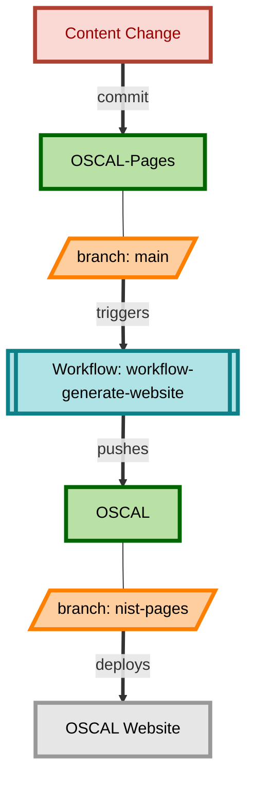

# Reorganization of Project Repositories and Workflows

Date: 2023/07/06

## Status

Approved

## Context

In the current sprint it was decided to attempt a rapid prototype of a work-stream-oriented approach to the repositories, compartmentalization and simplification of the CI workflows, and where possible, reducing barriers to participation in different aspects of OSCAL growth and development.

The majority of this work occurred in [OSCAL #1802](https://github.com/usnistgov/OSCAL/issues/1802).

## Decision

This is an outline of what was implemented:

---

### Public OSCAL Website

The public website will be managed in the [OSCAL-Pages Repository](https://github.com/usnistgov/OSCAL-Pages).  This portion of the website is built using Hugo and the USWDS styling.

#### Content for OSCAL repository:

In order to preserve the existing `pages.nist.gov/OSCAL` link, OSCAL-Pages will generate the website, and then publish to the OSCAL project in the `nist-pages` branch so that it will properly publish to the NIST required approach for deploying pages content.

#### Content in OSCAL-Pages repository:

A `published-pages` branch will also exist in OSCAL-Pages that contains the latest deployed content that is sent to the OSCAL repository.  Additionally, there is a `nist-pages` branch in the OSCAL-Pages project that contains a blank page.  This branch could be used to test a deployment of the website at `pages.nist.gov/OSCAL-Pages`, but it is important to be aware that this site could be indexed by search engines and cause confusion, as well as broken links.

---

### Public OSCAL Reference

The reference portion of the OSCAL Website will move into an independent [OSCAL-Reference Repository](https://github.com/usnistgov/OSCAL-Reference).  This repository will be more complex than the basic HTML content of the OSCAL website since it generates the documentation from the OSCAL metaschema content.  Due to this complexity, and the potential of future expansion and capabilities in the developer-focused documentation, this was separated, and will be linked into the main OSCAL website.

Each tagged version of OSCAL will be published through CI.

#### Streamlined Build Process

The new reference repository operates off of one GitHub Actions Workflow that produces the documentation from `metaschema` and uses `Hugo` to publish the website. All of the scripted aspects of the model interpretation are executed using `make`, and the `Makefile` is located in the root of the repository.

`OSCAL` and `metaschema-xslt` are submodules of this repository.

---

### OSCAL GitHub Project

The most significant changes to the repositories are in the OSCAL repository. 

1. All web content and related workflows have been removed.
2. The schemas and converters that are built and committed back to the OSCAL repository have been removed and are no longer set to auto-commit.
   1. The artifact from the build is still produced and will be a part of the release.
   2. The artifact could be deployed to the reference site if the desire is to have a web accessible publication.

This does have consequences, and those are discussed below.  The benefits are that the repository is very lean and primarily contains the metaschema content and scripts to build OSCAL, as well as decision records.  This will allow developers to watch the repository with activity focused on OSCAL itself.

This also allows for separate, asynchronous streams of work across the website/education, reference content and production of OSCAL models.  It also provides more opportunity for community participation at differing levels such as web content production, model development, and improved developer documentation.

## Consequences

There are a few breaking changes to our processes:

1. We will separate one large repository into three distinct repositories.
   - Links to any content that is moved will break.
   
2. We remove the schemas and converters from the repository.  
   - Similarly to #1, this will break any links directly to this content.

## Release Approach

The current rapid prototype exists without breaking existing repositories, workflows or processes.  To cut over to the new approach, the following will need to occur:

- Website
  - The OSCAL-Reference website will need to be deployed from `main`.
  - The OSCAL-Pages website will require an update to the workflow so that it publishes to `nist-pages` branch in the OSCAL repository, rather than the `next-pages` branch.
  - Verify that the following are up to date and accessible:
      - https://pages.nist.gov/OSCAL-Reference
      - https://pages.nist.gov/OSCAL
  - Note the latest update date in the footer of each site.
      - Both should have a date that is on or after July 5, 2023.

- OSCAL
    - We should notify the public of the pending release, and the changes noted in this ADR.
        - For developers (and products) that link directly to content in the OSCAL repository, they may update their links to point to tagged releases, rather than using source files in the main branch.  Future dependencies linking directly to source code in the OSCAL repository, particularly `main`, should be discouraged since this could impact the ability of the development team to improve source code as necessary to build OSCAL.
        - Future links to schemas and converters should use release assets (see [v1.0.6](https://github.com/usnistgov/OSCAL/releases/tag/v1.0.6) for an example of assets). We currently produce zip archives as a part of releases.  We intend to also include the schemas and converters directly in the release assets without having to extract from the zip file.  **This will be implemented in a future sprint.**
    - The release documentation should be updated to align with the changes to this branch.
    - All `Website` steps must be completed.
    - The `feature-1802-oscal-pages` branch will need to be merged to main in `OSCAL.`
    - The updated release documentation should be followed to produce a release.
    - The contents of the schemas and converters should be compared to the previous release to ensure valid output with no unexpected changes.
    
