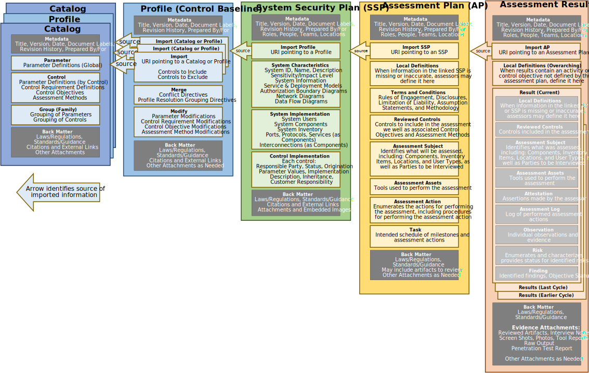

| Assessment Results Schema | Assessment Results Converters | Reference
|:--- |:--- |:--- |
| [JSON Schema](https://raw.githubusercontent.com/usnistgov/OSCAL/main/json/schema/oscal_assessment-results_schema.json) | [XML to JSON Converter](https://raw.githubusercontent.com/usnistgov/OSCAL/main/json/convert/oscal_assessment-results_xml-to-json-converter.xsl) ([How do I use this?](https://github.com/usnistgov/OSCAL/tree/main/json#converting-oscal-xml-content-to-json)) | [Outline](/reference/latest/assessment-results/json-outline/) [Reference](/reference/latest/assessment-results/json-reference/) [Index](/reference/latest/assessment-results/json-index/) |
| [XML Schema](https://raw.githubusercontent.com/usnistgov/OSCAL/main/xml/schema/oscal_assessment-results_schema.xsd) | [JSON to XML Converter](https://raw.githubusercontent.com/usnistgov/OSCAL/main/xml/convert/oscal_assessment-results_json-to-xml-converter.xsl) ([How do I use this?](https://github.com/usnistgov/OSCAL/tree/main/xml#converting-oscal-json-content-to-xml)) | [Outline](/reference/latest/assessment-results/xml-outline/) [Reference](/reference/latest/assessment-results/xml-reference/) [Index](/reference/latest/assessment-results/xml-index/) |

## Purpose

The OSCAL Assessment Results model defines the information contained within an assessment report supporting assessment and continuous monitoring capabilities.

## Authors and Consumers

### Assessment Results Authors

Assessors, Continuous Assessment Tools

Assessors develop the assessment results to report what was assessed, how it was assessed, who performed the assessment, what was found, and what risks were identified.

### Assessment Results Consumers

System Owners, Authorizing Officials, Continuous Assessment Monitoring Practitioners

System owners consume the assessment results to understand the risk posture of their system, as well as to target risks for remediation and plan risk remediation activities.

Authorizing officials consume assessment results in the adjudication of a system as part of approving an authorization to operate.

Continuous assessment monitoring practitioners consume the assessment results as part of monitoring the system's security posture.

##  Assessment Results Organization

{}
{}
{}
An OSCAL profile is organized as follows:
- **Metadata**: Metadata syntax is identical and required in all OSCAL models. It includes information such as the file's title, publication version, publication date, and OSCAL version. Metadata is also used to define roles, parties (people, teams and organizations), and locations.
- **Import AP**: Identifies the OSCAL-based assessment plan (AP) for this assessment. The AP imports several pieces of information about the system being assessed including the system security plan (SSP), which is also represented according to the OSCAL [SSP model](../../implementation/ssp/). This linking of data eliminates the need to duplicate and maintain the same information in multiple places.
- **Local Definitions**: When the assessment results contain an activity or control objective not defined by the assessment plan, assessors define it here instead.
- **Results**: Describes the assessment findings, identified risks, and recommended remediation. Also identifies false positive results, risk adjustments, and operationally required risks, as well as when the results should expire.
  - **Local Definitions**: Normally other aspects of the assessment results point to content in the linked Assessment Plan and SSP. When the AR must reference information that is missing from the linked AP or SSP, assessors define it here instead.
  - **Reviewed Controls**: Identifies the controls actually reviewed by this assessment.
  - **Assessment Subject**: Identifies the in-scope elements of the system, including locations, components, inventory items, and users.
  - **Assessment Assets**: Identifies the assessor's assets used to perform the assessment, including the team, tool, and rules of engagement content.
  - **Attestation**: Assertions made by the assessor.
  - **Assessment Log**: Log of performed assessment actions. This includes start and end timestamps for individual actions performed by the assessment team, with an optional link to defined assessment actions.
  - **Observation**: Individual observations and related evidence. This may be evidence of compliance or non-compliance.
  - **Risk**: Identifies individual risks, including weakness description, risk statement, and other risk characteristics.
  - **Finding**: Identifies findings resulting from observations and risks, and can include the control objective status.
- **Back Matter**: Back matter syntax is identical in all OSCAL models. It is used for attachments, citations, and embedded content such as graphics.
{}
{}

{}
{}
{}

## Key Concepts

The OSCAL Assessment Results model is part of the [OSCAL Assessment Layer](../). It defines structured, machine-readable XML, JSON, and YAML representations of the information contained within an assessment report.

This model is typically used by anyone performing assessment or continuous monitoring activities on a system to determine the degree to which that system complies with one or more frameworks.

This model allows an assessor to express all details associated with a classic "snapshot in time" assessment, including the scope of the assessment, times and dates of activities, actual assessment activities performed, as well as any observations, findings, and identified risks. It also allows organizations to report continuous assessment information.

OSCAL assessment results are always defined in the context of an assessment plan, and must always be associated with an OSCAL [Assessment Plan (AP)](../assessment-plan/). OSCAL assessment results are associated with a specific system via the OSCAL assessment plan, which identifies the system to be assessed.

The current version of this model was created based on the information requirements of a [FedRAMP Security Assessment Report](https://www.fedramp.gov/assets/resources/templates/FedRAMP-Annual-SAR-Template.docx), and was expanded to include continuous assessment capabilities.

This model was designed to use identical syntax to the [assessment plan model](../assessment-plan/), for overlapping syntax (Objectives, Assessment Subject, Assets, and Assessment Activities). It was also designed to use identical syntax to the [Plan of Action and Milestones (POA&M)](../poam/), for Results/Risks.

The figure below expresses represents the portion of the OSCAL stack as it relates to an OSCAL Assessment Results.


