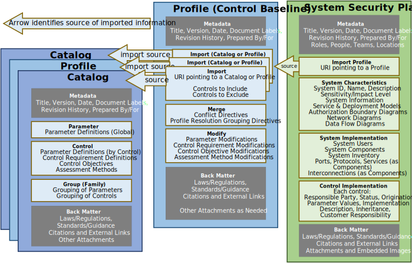

| SSP Schema | SSP Converters | Reference |
|:--- |:--- |:--- |
| [JSON Schema](https://raw.githubusercontent.com/usnistgov/OSCAL/main/json/schema/oscal_ssp_schema.json) | [XML to JSON Converter](https://raw.githubusercontent.com/usnistgov/OSCAL/main/json/convert/oscal_ssp_xml-to-json-converter.xsl) ([How do I use this?](https://github.com/usnistgov/OSCAL/tree/main/json#converting-oscal-xml-content-to-json)) | [Outline](/reference/latest/system-security-plan/json-outline/) [Reference](/reference/latest/system-security-plan/json-reference/) [Index](/reference/latest/system-security-plan/json-index/) |
| [XML Schema](https://raw.githubusercontent.com/usnistgov/OSCAL/main/xml/schema/oscal_ssp_schema.xsd) | [JSON to XML Converter](https://raw.githubusercontent.com/usnistgov/OSCAL/main/xml/convert/oscal_ssp_json-to-xml-converter.xsl) ([How do I use this?](https://github.com/usnistgov/OSCAL/tree/main/xml#converting-oscal-json-content-to-xml)) | [Outline](/reference/latest/system-security-plan/xml-outline/) [Reference](/reference/latest/system-security-plan/xml-reference/) [Index](/reference/latest/system-security-plan/xml-index/) |

## Purpose

The OSCAL system security plan (SSP) model represents a description of the control implementation of an information system. The SSP model is part of the OSCAL [implementation](../) layer.

The OSCAL SSP model enables full modeling of highly granular SSP content, including points of contact, system characteristics, and control satisfaction descriptions. At a more detailed level, this includes the system's authorization boundary, information types and categorization, inventory, and attachments. In terms of control satisfaction, it models control parameter values, responsible roles, implementation status, control origination, and a description of control satisfaction at a level of granularity down to a specific control statement. Control satisfaction can be defined for the system as a whole or for individual implemented components.

## Authors and Consumers

### SSP Authors

System Owners and System Security Plan Authors

Through delegation, system owners create and maintain SSP content to document the implementation of controls within their system.

### SSP Consumers

Assessors, Customers, Authorizing Officials, Leveraging System Owners

Assessors consume SSPs in the planning and execution of a system assessment relative to an established control baseline and compliance framework.
Authorizing Officials consume SSPs in the adjudication of a system as part of approving an authorization to operate.

## Model Overview

{}
{}
{}
An OSCAL profile is organized as follows:
- **Metadata**: Metadata syntax is identical and required in all OSCAL models. It includes information such as the document's title, publication version, publication date, and OSCAL version. Metadata is also used to define roles, parties (people, teams and organizations), and locations.
- **Import Profile**: Identifies the applicable control baseline for the system. This baseline is represented as an OSCAL [profile](../../control/profile/).
- **System Characteristics**: Represents attributes of the system, such as its name, description, models, and information processed.
- **System Implementation**: Represents relevant information about the system's deployment, including user roles, interconnections, services, and system inventory.
- **Control Implementation**: Describes how each control in the baseline is implemented within the system.
- **Back Matter**: Back matter syntax is identical in all OSCAL models. It is used for attachments, citations, and embedded content such as graphics.
{}
{}

{}
{}
{}

## Key Concepts

The OSCAL system security plan (SSP) model represents a description of the control implementation of an information system. The SSP model is part of the OSCAL [implementation](../) layer.

The OSCAL SSP model enables full modeling of highly granular SSP content, including points of contact, system characteristics, and control satisfaction descriptions. At a more detailed level, this includes the system's authorization boundary, information types and categorization, inventory, and attachments. In terms of control satisfaction, it models control parameter values, responsible roles, implementation status, control origination, and a description of control satisfaction at a level of granularity down to a specific control statement. Control satisfaction can be defined for the system as a whole or for individual implemented components.

The figure below expresses represents the portion of the OSCAL stack as it relates to an OSCAL SSP.



### Identifier References

An OSCAL SSP may contain references to information that is defined locally (e.g., in the SSP model) or externally (e.g., in a referenced profile, catalog, or component definition model).  The following lists the mechanisms through which objects in an OSCAL SSP may "link" to other OSCAL content:

- **Local**: Scenario where an identifier references information in the same OSCAL instance.  This scenario supports  enforcement of constraints since the validity of the reference can be checked as soon as the SSP is authored.
- **Import-Profile**:  Scenario where an identifier references information in its imported profile.  This scenario can support “compile time” enforcement of constraints if there is access to the imported OSCAL profile.
- **Leveraged-Authorizations/Links**:  In this scenario where an OSCAL SSP has leveraged-authorization(s), some of the information in the leveraged SSP may be referenced (e.g., if the leveraged SSP is also in OSCAL format).  This scenario supports “runtime” validation of constraints since SSP author may or may not have access the leveraged system SSP to validate / enforce the referential integrity.  However, the authorizing official (AO) must ultimately validate any such links and references.
- **Component Definition (CDEF) Links**:  Scenario where an OSCAL SSP component has a reference to a component definition and/or references to a specific component within a component definition.  This scenario can support enforcement of constraints over the component definition, if it is resolvable.
- **Links**: Aside from OSCAL specific links such as Leveraged-Authorizations/Link, general OSCAL links do not provide enough contextual information to know if the link target 1) is an OSCAL document and 2) what type of OSCAL model. Additionally, there is no assurance that SSP authors have access to linked OSCAL instances, so any references to content in external links cannot be validated.

### Reference Constraints

The following table summarizes constraints for identifier references in an OSCAL SSP:

| Reference | Target Scope | Target Element | Target ID Type | Referential Constraint Description |
| :-------- | :----------- | :------------: | :------------: | :--------------------------------- |
| `@component-uuid`  ([XML](/reference/latest/system-security-plan/xml-reference/#/system-security-plan/system-implementation/component/@uuid) &#124; [JSON](/reference/latest/system-security-plan/json-reference/#/system-security-plan/system-implementation/components/uuid)) | Local SSP, leveraged-authorization | `component`  ([XML](/reference/latest/system-security-plan/xml-reference/#/system-security-plan/system-implementation/component) &#124; [JSON](/reference/latest/system-security-plan/json-reference/#/system-security-plan/control-implementation/implemented-requirements/by-components/component-uuid)) | UUID | Inventory item reference to a single target component must be found in target SSP instance. Component must be defined in local SSP or leveraged SSP. |
| `@component-uuid`  ([XML](/reference/latest/system-security-plan/xml-reference/#/system-security-plan/control-implementation/implemented-requirement/by-component/@component-uuid) &#124; [JSON](/reference/latest/system-security-plan/json-reference/#/system-security-plan/control-implementation/implemented-requirements/by-components/component-uuid)) | Local SSP, leveraged-authorization | `component`  ([XML](/reference/latest/system-security-plan/xml-reference/#/system-security-plan/system-implementation/component) &#124; [JSON](/reference/latest/system-security-plan/json-reference/#/system-security-plan/control-implementation/implemented-requirements/by-components/component-uuid)) | UUID | Reference to a component that is implementing a control.  A single target component must be found in target SSP instance. Component must be defined in local SSP or leveraged SSP. |
| `@control-id`  ([XML](/reference/latest/system-security-plan/xml-reference/#/system-security-plan/control-implementation/implemented-requirement/@control-id) &#124; [JSON](/reference/latest/system-security-plan/json-reference/#/system-security-plan/control-implementation/implemented-requirements/control-id)) | Local SSP, leveraged-authorization | `control`  ([XML](/reference/latest/catalog/xml-reference/#/catalog/control/@id) &#124; [JSON](/reference/latest/catalog/json-reference/#/catalog/controls/id)) | Token | A single target control must be found in the baseline. |
| `@control-id`  ([XML](/reference/latest/system-security-plan/xml-reference/#/system-security-plan/control-implementation/implemented-requirement/@control-id) &#124; [JSON](/reference/latest/system-security-plan/json-reference/#/system-security-plan/control-implementation/implemented-requirements/control-id)) | Local SSP, leveraged-authorization | `control`  ([XML](/reference/latest/catalog/xml-reference/#/catalog/group/control/@id) &#124; [JSON](/reference/latest/catalog/json-reference/#/catalog/groups/controls/id)) | Token | A single target control, within a group, must be found in the baseline. |
| `@provided-uuid`  ([XML](/reference/latest/system-security-plan/xml-reference/#/system-security-plan/control-implementation/implemented-requirement/statement/by-component/export/responsibility/@provided-uuid) &#124; [JSON](/reference/latest/system-security-plan/json-reference/#/system-security-plan/control-implementation/implemented-requirements/statements/by-components/export/responsibilities/provided-uuid)) | Local SSP | `statement`  ([XML](/reference/latest/system-security-plan/xml-reference/#/system-security-plan/control-implementation/implemented-requirement/statement/@uuid) &#124; [JSON](/reference/latest/system-security-plan/json-reference/#/system-security-plan/control-implementation/implemented-requirements/statements/uuid)) | UUID | Reference to a control implementation which may be inherited by a leveraging system.  A single target provided control implementation statement must be found in the SSP. |
| `@provided-uuid`  ([XML](/reference/latest/system-security-plan/xml-reference/#/system-security-plan/control-implementation/implemented-requirement/statement/by-component/inherited/@provided-uuid) &#124; [JSON](/reference/latest/system-security-plan/json-reference/#/system-security-plan/control-implementation/implemented-requirements/statements/by-components/inherited/provided-uuid)) | leveraged-authorization | `provided`  ([XML](/reference/latest/system-security-plan/xml-reference/#/system-security-plan/control-implementation/implemented-requirement/statement/by-component/export/responsibility/@provided-uuid) &#124; [JSON](/reference/latest/system-security-plan/json-reference/#/system-security-plan/control-implementation/implemented-requirements/statements/by-components/export/responsibilities/provided-uuid)) | UUID | Reference to a control implementation statement that is inherited from a leveraged system.  A single target provided control implementation statement must be found in the leveraged SSP. |
| `@provided-uuid`  ([XML](/reference/latest/system-security-plan/xml-reference/#/system-security-plan/control-implementation/implemented-requirement/by-component/export/responsibility/@provided-uuid) &#124; [JSON](/reference/latest/system-security-plan/json-reference/#/system-security-plan/control-implementation/implemented-requirements/by-components/export/responsibilities/provided-uuid)) | Local SSP | `implemented-requirement`  ([XML](/reference/latest/system-security-plan/xml-reference/#/system-security-plan/control-implementation/implemented-requirement/@uuid) &#124; [JSON](/reference/latest/system-security-plan/json-reference/#/system-security-plan/control-implementation/implemented-requirements/uuid)) | UUID | Reference to a control implementation which may be inherited by a leveraging system.  A single target provided control implementation (implemented-requirement) must be found in the SSP. |
| `@provided-uuid`  ([XML](/reference/latest/system-security-plan/xml-reference/#/system-security-plan/control-implementation/implemented-requirement/by-component/inherited/@provided-uuid) &#124; [JSON](/reference/latest/system-security-plan/json-reference/#/system-security-plan/control-implementation/implemented-requirements/by-components/inherited/provided-uuid)) | leveraged-authorization | `provided`  ([XML](/reference/latest/system-security-plan/xml-reference/#/system-security-plan/control-implementation/implemented-requirement/by-component/export/responsibility/@provided-uuid) &#124; [JSON](/reference/latest/system-security-plan/json-reference/#/system-security-plan/control-implementation/implemented-requirements/by-components/export/responsibilities/provided-uuid)) | UUID | Reference to a control implementation that is inherited from a leveraged system.  A single target provided control implementation must be found in the leveraged SSP. |
| `party-uuid`&ast;   &ast;*various references* | Local SSP, leveraged-authorization | `party`  ([XML](/reference/latest/system-security-plan/xml-reference/#/system-security-plan/metadata/party/@uuid) &#124; [JSON](/reference/latest/system-security-plan/json-reference/#/system-security-plan/metadata/parties/uuid)) | UUID | This is a reference to a party (person or organization).  A single target party must be found by the UUID. |
| `@role-id`&ast;   &ast;*various references* | Local SSP, leveraged-authorization | `role`  ([XML](/reference/latest/system-security-plan/xml-reference/#/system-security-plan/metadata/role/@id) &#124; [JSON](/reference/latest/system-security-plan/json-reference/#/system-security-plan/metadata/roles/id)) | Token | This is a reference to a role.  A single role party must be found by the ID. |
| `@param-id`&ast;   &ast;*various references* | Baseline (e.g., Import-Profile) | `param`  ([XML](/reference/latest/catalog/xml-reference/#/catalog/param) &#124; [JSON](/reference/latest/catalog/json-reference/#/catalog/params)) | Token | This is a reference to a parameter defined in (resolved) baseline.  A single target parameter must be found by the ID. |
| `@param-id`&ast;   &ast;*various references* | Baseline (e.g., Import-Profile) | `param`  ([XML](/reference/latest/catalog/xml-reference/#/catalog/control/param) &#124; [JSON](/reference/latest/catalog/json-reference/#/catalog/controls/params)) | Token | This is a reference to a parameter defined in (resolved) baseline.  A single target parameter must be found by the ID. |
| `@param-id`&ast;   &ast;*various references* | Baseline (e.g., Import-Profile) | `param`  ([XML](/reference/latest/catalog/xml-reference/#/catalog/group/param) &#124; [JSON](/reference/latest/catalog/json-reference/#/catalog/groups/params)) | Token | This is a reference to a parameter defined in (resolved) baseline.  A single target parameter must be found by the ID. |
| `@param-id`&ast;   &ast;*various references* | Baseline (e.g., Import-Profile) | `param`  ([XML](/reference/latest/catalog/xml-reference/#/catalog/group/control/param) &#124; [JSON](/reference/latest/catalog/json-reference/#/catalog/groups/controls/params)) | Token | This is a reference to a parameter defined in (resolved) baseline.  A single target parameter must be found by the ID. |
| `@statement-id`  ([XML](/reference/latest/system-security-plan/xml-reference/#/system-security-plan/control-implementation/implemented-requirement/statement/@statement-id) &#124; [JSON](/reference/latest/system-security-plan/json-reference/#/system-security-plan/control-implementation/implemented-requirements/statements/statement-id)) | Local SSP, leveraged-authorization | `statement`  ([XML](/reference/latest/system-security-plan/xml-reference/#/system-security-plan/control-implementation/implemented-requirement/statement) &#124; [JSON](/reference/latest/system-security-plan/json-reference/#/system-security-plan/control-implementation/implemented-requirements/statements)) | Token | A single target statement must be found in the SSP. |
| `role-id `  ([XML](/reference/latest/system-security-plan/xml-reference/#/system-security-plan/system-implementation/user/role-id) &#124; [JSON](/reference/latest/system-security-plan/json-reference/#/system-security-plan/system-implementation/users/role-ids)) | Local SSP | `role`  ([XML](/reference/latest/system-security-plan/xml-reference/#/system-security-plan/metadata/role) &#124; [JSON](/reference/latest/system-security-plan/json-reference/#/system-security-plan/metadata/roles)) | Token | A single target role must be found in the source. Role could be defined in local instance metadata. |
<!--
| [leveraged-authorization/party-uuid](/reference/latest/system-security-plan/xml-index/#/party-uuid) | Leveraged-Authorization | Party | UUID | A single target party must be found by the UUID, a pointer to the party that manages the leveraged system. |
| [responsibility/@provided-uuid](/reference/latest/system-security-plan/xml-index/#/@provided-uuid) | Local SSP | Export/ Responsibility | UUID | A single target control must be found in the source. Reference to a control, in the local SSP, that is exported as a customer responsibility for leveraging systems. |
| [responsible-party/@role-id](/reference/latest/system-security-plan/xml-index/#/@role-id) | Local SSP | Role | Token | A single target role must be found in the source. System-characteristics/responsible-party/@role-id and inventory-item\*/responsible-party/@role-id are points of reference, so it is appropriate to enforce a local constraint. |
| [responsible-party/party-uuid](/reference/latest/system-security-plan/xml-index/#/party-uuid) | Local SSP | Party | UUID | A single target party must be found in the source. System-characteristics/responsible-party/party-uuid and inventory-item\*/responsible-party/party-uuid are the points of reference, so they are appropriate to enforce a local constraint. |
| [responsible-role/@role-id](/reference/latest/system-security-plan/xml-index/#/@role-id) | Local SSP, leveraged-authorization | Role | Token | A single target role must be found by the ID. |
| [responsible-role/party-uuid](/reference/latest/system-security-plan/xml-index/#/party-uuid) | Local SSP, leveraged-authorization | Party | UUID         | A single target role must be found by the UUID. |
-->
### Modeling Validation Information
OSCAL is designed to allow capture relevant details related to independent validation of components. See the [Validation Modeling](/learn/tutorials/validation-modeling/) tutorial for details.

## Content Examples

Multiple examples of SSP expressed using the OSCAL SSP model can be found in the OSCAL GitHub repository in [XML](/examples/ssp/xml),
[JSON](/examples/ssp/json),
and [YAML](/examples/ssp/yaml/) formats.

## Related Tutorials

The following tutorial is provided related to the catalog model.

- [Representing Test Validation Information](/learn/tutorials/validation-modeling/): Explains how to represent test validation information (e.g., FIPS-140-2) for a component in an OSCAL SSP.
