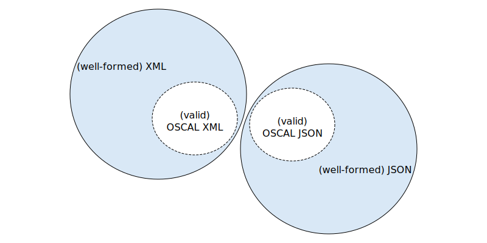

## Who is this document for?

If you are an [OSCAL tool developer](/about/stakeholders/tooldevelopers/), you should read this document to better understand how to use the OSCAL model. This document provides and explains some terminology the OSCAL community uses in development and troubleshooting.

If you are not an OSCAL tool developer, this technical information might be useful if you seek general understanding of OSCAL, or if as a tool user you encounter them in your work.

## Why are these concepts important?

It is important that OSCAL tool developers know how to use, and build, software that can confirm that JSON-, XML-, or YAML-based [OSCAL document instances](/concepts/layer/) are well-formed and valid. Being able to validate documents against externally-specified schemas (mutually and generally understood) is a foundation of robust, secure data interchange and interoperability. 

Generally, both "well-formedness" and "validity" of OSCAL instance data determine if a *conformant OSCAL application* can process such data. In this way, "well-formedness" and "validity" define the boundary between what can be considered OSCAL data and what cannot. The degree to which an application can support well-formed, valid OSCAL data defines how conformant the application is.

## What do "well-formed" and "valid" mean to the OSCAL community?

When developing tools to read or write OSCAL, developers will ask if your data set (files) are *well-formed* and *valid* OSCAL documents. We define these terms below and explain how current OSCAL tools support checking well-formed data and valid OSCAL.

### What is well-formed data?

*Well-formed* means that your JSON, XML, YAML (whether it is OSCAL or not) follows the syntax rules of that format.

#### What OSCAL tools help you check well-formedness?

NIST's OSCAL tools do not explicitly check that JSON, XML, or YAML is well-formed. If you are a tool developer, we expect you to use your language runtime and libraries to parse JSON, XML, and YAML and check for the well-formed data. This must occur before validating an OSCAL document.

### What is a valid OSCAL document?

*Valid* means that your JSON-, XML-, or YAML-based OSCAL document, which has already been checked for *well-formedness*, follows the structural rules of an OSCAL model. A model can be expressed using a schema format, such as [JSON Schema](https://json-schema.org/) or [XML Schema](https://www.w3.org/XML/Schema), both of which provide a means to define structural rules which can be applied in addition to the required syntax of the related format.

The term "valid" has a technical meaning, which can be quite specific to an operational context (including whether XML, JSON or YAML, tools in use, and the standards and languages on which they are based).

OSCAL reaches across such contexts for JSON, XML, and YAML, so the term has additional meaning for OSCAL. The various OSCAL models defining validity (in the different formats) are produced from unified sources, so they are always consistent and aligned with one another. Thus, you have a valid OSCAL XML document, you can convert it *without information loss* into an equivalent OSCAL JSON document, and vice-versa.

### Does OSCAL provide schemas for OSCAL models?

The OSCAL program develops and maintains schema documents conformant with [JSON Schema](https://github.com/usnistgov/OSCAL/tree/main/json/schema) to validate OSCAL documents in JSON and YAML data formats. For validating XML, we provide schema documents using [XML Schema Definition](https://github.com/usnistgov/OSCAL/tree/main/xml/schema) Language.

### What tools check that an OSCAL document is valid?

There are many tools to validate documents using schema formats.

Here are some Internet resources to help you find a tool.

- [JSON Schema validator](https://json-schema.org/implementations.html#validators)
- [XML Schema validators](https://www.w3.org/XML/Schema#Tools)

**Note: These lists are not exaustive and NIST does not endorse any of these tools.**

### Why can OSCAL document validation fail?

There are multiple failure scenarios for OSCAL documents, and more generally JSON, XML, and YAML. Which one of these is the case, and the general approach to resolve that scenario, will ordinarily be indicated by the error message or exception returned by the processor.

1. **The document is not well-formed, so validation cannot occur.** You must fix errors in JSON, XML, or YAML syntax so the document is well-formed.
2. **The wrong schema is selected to validate the document.** You must use the validation processor again with the correct schema.
3. **The specified schema does not exist or is not present.** You must run the validation processor again identifying the correct schema and location, or create a schema if it does not exist. (NOTE: The latter is a general failure case, but all OSCAL models have existing JSON, XML, and YAML schema support.)
4. **In the case of XML, the schema namespace and target document's namespace do not match.** You must run the validation processor again with matching namespaces in the schema and target document.
5. **The document is well-formed, but is not conformant to the schema and errors are correctly reported.** You must correct specific content, and you must run the validation processor again to confirm the errors in content are corrected.
