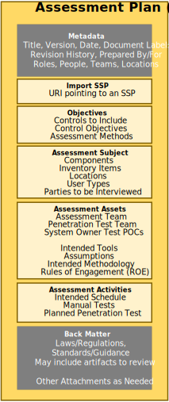

## Purpose

The OSCAL assessment plan model defines the information contained within an assessment plan, and is typically used by anyone planning to perform assessment or continuous monitoring activities on a system to determine the degree to which that system complies with one or more frameworks.

The current version of this model was created based on the information requirements of a [FedRAMP Security Assessment Plan](https://www.fedramp.gov/assets/resources/templates/FedRAMP-Annual-SAP-Template.docx), and was expanded to include continuous monitoring capabilities. 
It was designed to use identical syntax to the [assessment results model](/documentation/schema/assessment-results-layer/assessment-results/), for overlapping assemblies (Objectives, Assessment Subject, Assets, and Assessment Activities). 

## Concepts

Component definition model concepts are described in [concepts](../../concepts/#assessment-plan-model-concepts).

## Authors and Consumers

### Assessment Plan Authors

<table><tr><td style="background-color:#cccccc; border:none">
Assessors, Continuous Assessment Planners
</td></tr></table>

Assessors develop the assessment plan to clearly identify the intended scope, target, and activities for an assessment.

### Assessment Plan Consumers

<table><tr><td style="background-color:#cccccc; border:none">
Assessment Practitioners, Authorizing Officials, Continuous Assessment Implementers
</td></tr></table>

Assessment practitioners consume the assessment plan as they execute the assessment to ensure the intended scope, target, and activities are being honored.
Authorizing Officials consume assessment plan in the adjudication of a system as part of approving an authorization to operate.
Continusous assessment implementers consume the assessment plan when establishing automated continuous assessment mechanisms.

##  Assessment Plan Organization

{}
{}
{}
&nbsp;

{}
{}
An OSCAL profile is organized as follows:
- **Metadata**: Metadata syntax is identical and required in all OSCAL models. It includes information such as the file's title, publication version, publication date, and OSCAL version. Metadata is also used to define roles, parties (people, teams and organizations), and locations.
- **Import SSP**: Identifies the OSCAL-based SSP of the system being assessed. Several pieces of information about a system that normally appear in an assessment plan are now referenced via this import statement.
- **Objectives**: Identifies the controls to be included within the scope of this assessment, as well as the control objectives and assessment methods.
- **Assessment Subject**: Identifies the in-scope elements of the system, including locations, components, inventory items, and users.  
- **Assessment Assets**: Identifies the assessor's assets used to perform the assessment, including the team, tool, and rules of engagement content.
- **Assessment Activities**: Describes the schedule, manual and automated tests, and other activities that may be explicitly be allowed or prohibited. 
- **Back Matter**: Back matter syntax is identical in all OSCAL models. It is used for attachments, citations, and embedded  content such as graphics. 
{}
{}

{}

