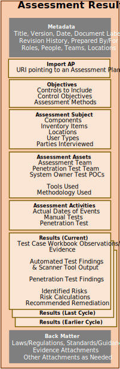

## Purpose

The OSCAL Assessment Results model defines the information contained within an assessment report.

The current version of this model was created based on the information requirements of a [FedRAMP Security Assessment Report](https://www.fedramp.gov/assets/resources/templates/FedRAMP-Annual-SAR-Template.docx), and was expanded to include continuous assessment capabilities. 

This model was designed to use identical syntax to the [assessment plan model](/documentation/schema/assessment-layer/assessment-plan/), for overlapping assemblies (Objectives, Assessment Subject, Assets, and Assessment Activities). It was also designed to use identical syntax to the [Plan of Action and Milestones (POA&M)](/documentation/schema/assessment-results-layer/poam/), for Result/Risks. 

## Concepts

Component definition model concepts are described in [concepts](../../concepts/#assessment-plan-model-concepts).

## Authors and Consumers

### Assessment Results Authors

<table><tr><td style="background-color:#cccccc; border:none">
Assessors, Continuous Assessment Tools
</td></tr></table>

Assessors develop the assessment results to report what was assessed, how it was assessed, who performed the assessment, what was found, and what risks were identified.

### Assessment Results Consumers

<table><tr><td style="background-color:#cccccc; border:none">
System Owners, Authorizing Officials, Continuous Assessment Monitoring Practitioners
</td></tr></table>

System owners consume the assessment results to understand the risk posture of their system, as well as to plan risk remediation activities and target risks for remediation.
Authorizing officials consume assessment results in the adjudication of a system as part of approving an authorization to operate.
Continusous assessment monitoring practitioners consume the assessment results as part of monitoring the system's security posture.

##  Assessment Results Organization

{}
{}
{}
&nbsp;

{}
{}
An OSCAL profile is organized as follows:
- **Metadata**: Metadata syntax is identical and required in all OSCAL models. It includes information such as the file's title, publication version, publication date, and OSCAL version. Metadata is also used to define roles, parties (people, teams and organizations), and locations.
- **Import AP**: Identifies the OSCAL-based assessment plan for this assessment. Several pieces of information about the assessment are cited from the AP. The AP imports the SSP, which provides several pieces of information about the system being assessed. 
- **Objectives**: : Identifies the controls to be included within the scope of this assessment, as well as the control objectives and assessment methods.
- **Assessment Subject**: Identifies the in-scope elements of the system, including locations, components, inventory items, and users.
- **Assessment Assets**: Identifies the assessor's assets used to perform the assessment, including the team, tool, and rules of engagement content.
- **Assessment Activities**: Describes the schedule, manual and automated tests, and other activities that may be explicitly be allowed or prohibited. 
- **Results**: Describes the assessment findings, identified risks, and recommended remedation. Also identifies false positive results, risk adjustments, and operationally required risks, as well as expiration of results.
- **Back Matter**: Back matter syntax is identical in all OSCAL models. It is used for attachments, citations, and embedded  content such as graphics. 
{}
{}

{}
