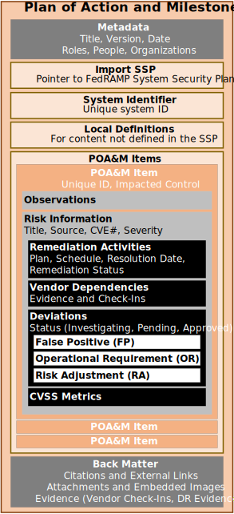

## Purpose

The OSCAL Plan of Action and Milestones (POA&M) model defines the information contained within a POA&M. 

The current version of this model was created based on the information requirements of a [FedRAMP POA&M](https://www.fedramp.gov/assets/resources/templates/FedRAMP-POAM-Template.xlsm). 
It was designed to use identical syntax to the [assessment results model](/documentation/schema/assessment-results-layer/assessment-results/), for overlapping assemblies (results: observations and risks), which allows easy transfer of identified risks for an assessment report to a POA&M. 

## Concepts

Component definition model concepts are described in [concepts](../../concepts/#assessment-plan-model-concepts).

## Authors and Consumers

### Assessment Results Authors

<table><tr><td style="background-color:#cccccc; border:none">
System Informaiton System Security Officers (ISSOs)
</td></tr></table>

ISSOs use a POA&M to identify risks to the system and track remediation acitivites on behalf of the system owner.

### Assessment Results Consumers

<table><tr><td style="background-color:#cccccc; border:none">
System Owners, Authorizing Officials, Continuous Monitoring Practitioners, Customers
</td></tr></table>

System owners consume the POA&M to understand the risk posture of their system, and ensure remediation activities are occuring as planned.
Authorizing officials consume the POA&M in the adjudication of a system as part of approving an authorization to operate, and periodically to ensure the system continues to operate in a secure manner.
Continusous monitoring practitioners consume the POA&M as part of monitoring the system's security posture.

##  Assessment Results Organization

{}
{}
{}
&nbsp;

{}
{}
An OSCAL profile is organized as follows:
- **Metadata**: Metadata syntax is identical and required in all OSCAL models. It includes information such as the file's title, publication version, publication date, and OSCAL version. Metadata is also used to define roles, parties (people, teams and organizations), and locations.
- **Import SSP**: Identifies the OSCAL-based SSP of the system being assessed. Several pieces of information about a system that normally appear in the POA&M are now referenced via this import statement.
- **System Identifier**: Intended when a POA&M is not delivered with an SSP, this allows a continuous monitoring organization to uniquely identify the system associated with this POA&M.
- **Local Definitions**: Allows for the local definition of components and inventory items within the POA&M when they reference items not found in the associated SSP, such as the discovery of undocumented hosts, and a citation of the scanning tool used to identify a vulnerability.
- **POA&M Items**: Enumerates each individual POA&M item. Each entry includes the risk information, plan for remediation, and status. Where applicable, deviation information is also included.
- **Back Matter**: Back matter syntax is identical in all OSCAL models. It is used for attachments, citations, and embedded  content such as graphics. 
{}
{}

{}
