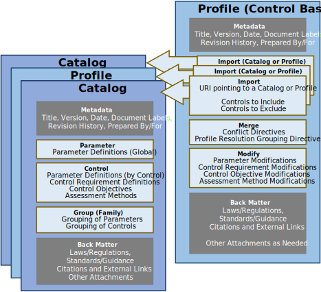
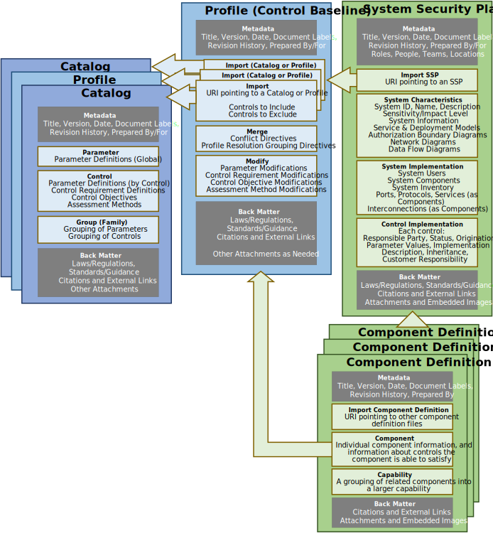
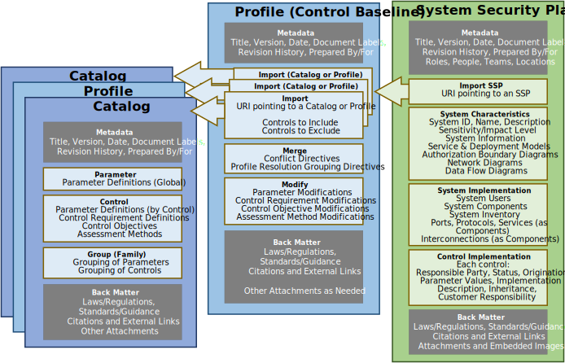
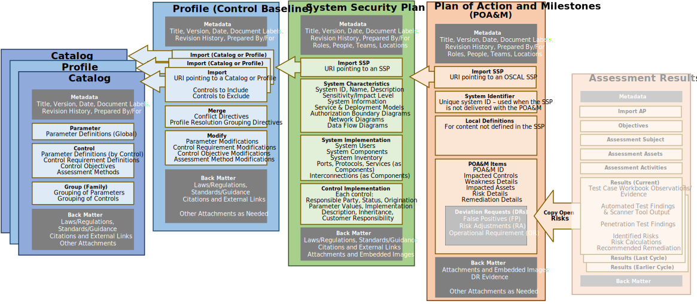

Information is organized logically within each OSCAL model. OSCAL models are also deisnged to interact, which provides traceability and minimizes duplication.

## General OSCAL Model Organization

Every OSCAL model includes a required metadata section, optional back-matter section, and mode-specific body.

## OSCAL File Organization

Every OSCAL file must have a minimum set of required fields and assemblies, and must follow the [core OSCAL syntax](../).

{}
{}
{}
&nbsp;

{}
{}
An OSCAL file is organized as follows:
- **Root Element**: The root element of the file indicates the type of content within the body of the file. 

- **UUID**: The [RFC 4122](https://tools.ietf.org/html/rfc4122) Version 4 Universally Unique ID (UUID) at the root must be changed every time the content of the file is modified.

- **Metadata**: Every OSCAL file must have a metadata section and include a title, last-modified timestamp, and OSCAL syntax version. Metadata is also used to define roles, parties (people, teams and organizations), and locations.

- **Model-specific Body**: The body of an OSCAL file is different for each model.

- **Back Matter**: Back matter syntax is identical in all OSCAL models. It is used for attachments, citations, and embedded content such as graphics. Tool developers and content authors are encouraged to attach content here and reference it from within the body of an OSCAL file.

{}
{}

{}

## Catalog Model Concepts

Many privacy and security compliance frameworks are based on **controls**. 
Framework authors provide control requirements, system owners impliment the controls, and assessors validate the implemented control against the requirement. 

Framework providers organize control requirements into a **catalog**.
The OSCAL catalog model is designed to represent control requirement information and its catalog organization in a machine-readable format with a high degree of fidelity and granularity.

An OSCAL catalog allows control requirements to be grouped, and allows individual control requirements to contain subordinate control requirements (enhancements), control objectives, assessment methods, references, and other content as may be necessary in some frameworks. 

The control model is the foundation for all other OSCAL models. 

### Control

In OSCAL, a control is *a requirement or guideline, which when implemented will reduce an aspect of risk related to an information system and its information.*

{}
A **security control** is defined in NIST Special Publication (SP) [SP 800-53 revision 5 (draft)](https://doi.org/10.6028/NIST.SP.800-53r5-draft) and the Office of Management and Budget Memorandum Circular [A-130](https://www.whitehouse.gov/sites/whitehouse.gov/files/omb/circulars/A130/a130revised.pdf), *Managing Information as a Strategic Resource*, as:

> The safeguards or countermeasures prescribed for an information system or an organization to protect the confidentiality, integrity, and availability of the system and its information.

These documents also define a **privacy control** as:

> The administrative, technical, and physical safeguards employed within an agency to ensure compliance with applicable privacy requirements and manage privacy risks.

These definitions align well to the control concept in OSCAL.
{}

OSCAL has been built for applications of controls that relate to privacy or security safeguards or countermeasures, such as in the two following examples. However, it may be possible to apply OSCAL beyond security or privacy controls for applications related to safety, health, or other purposes. These other applications have not been explored so far.

## Profile Model Concepts

OSCAL profiles define a set of operations that are to be performed on one or more control catalogs to suffeciently reduce and tailor the catalog for use as a system implementation baseline. As such, an OSCAL profile can be thought of as change lists or punch lists referencing one or more catalogs, defining any or all of the following:

* Which controls are *selected* from the catalog and thereby considered to be in scope for the application;
* How the control selection should be *organized* and represented, including whether and how competing control definitions are to be resolved and merged;
* Whether and where any controls are to be *configured* or modified; this includes setting parameter values for a catalog but also potentially amending the language given in controls to describe their application in the system.

See [examples](#content-examples) of OSCAL profiles.

These three functions are reflected in the organization of a profile document, which may contain (in addition to document metadata) any of three sections, `import`, `merge`, and `modify`:

* `import` (required) - indicates which controls to include or exclude from catalogs
* `merge` - what merge rules to follow and how to organize outputs
* `modify` - how to configure and/or modify parameters and control languages (statements, guidance etc.)

The figure below expresses represents the portion of the OSCAL stack as it relates to an OSCAL profile.

The figure below sketches how OSCAL relates profiles to catalogs. This example represents the NIST SP 800-53 low baseline. The profile indicates which controls from the NIST SP 800-53 catalog are required to for compliance with this baseline. Using OSCAL formats for these baselines makes the mappings between the control catalog and the profile explicit and machine readable. A single profile can reference controls in multiple catalogs. OSCAL permits profiles to use the same interoperable format irrespective of which catalogs are being used.

## Component Definition Model Concepts

The OSCAL component definition model represents a description of the controls that are supported in a given implementation of a hardware, software, service, policy, process, or procedure. 
Each defined component describes where appropriate:

- Information about the organization that provides, develops, and manages the thing described by the component;
- Characteristics of the component, such as its name, version, model, last-modified date, etc;
- Details about the controls that could be satisfied by the component;
- Configuration options for achieving specific security or privacy objectives; and
- Assessment tests or scripts that may be used to validate the component's implementation.

The component definition model allows grouping related components into capabilities, and documenting how the combination of components in a capability together can satisfy specific controls that are not fully satisfied by a single component on its own.

A component within a component definition can be used to document and share:

1. proof of compliance for a security requirement for hardware or software, such as FIPS 140-2 validated cryptography,
1. to document information about how a hardware, software, or service offering supports specific security or privacy controls, or
1. demonstrate how a policy or procedure implements a given set of security or privacy controls.

The figure below expresses represents the portion of the OSCAL stack as it relates to an OSCAL Component Definition.

## System Security Plan Model Concepts

The OSCAL system security plan (SSP) model represents a description of the control implementation of an information system. The SSP model is part of the OSCAL [implementation](../) layer.

The OSCAL SSP model enables full modeling of highly granular SSP content, including points of contact, system characteristics, and control satisfaction descriptions. At a more detailed level, this includes the system's authorization boundary, information types and categorization, inventory, and attachments. In terms of control satisfaction, it models control parameter values, responsible roles, implementation status, control origination, and a description of control satisfaction at a level of granularity down to a specific control statement. Control satisfaction can be defined for the system as a whole or for individual implemented components.

The figure below expresses represents the portion of the OSCAL stack as it relates to an OSCAL SSP.

## Assessment Plan Model Concepts

The OSCAL assessment plan model defines the information contained within an assessment plan. 

This model is typically used by anyone planning to perform assessment or continuous monitoring activities on a system to determine the degree to which that system complies with one or more frameworks.

This model allows an assessor to express all details associated with a classic "snapshot in time" assessment, including the scope of the assessment, schedule, intended activities, and the rules of engagement. It also allows organizations to specify clear continuous monitoring parameters, such as frequency and method of monitoring, as well as responsible monitoring roles. 

An OSCAL assessment plan is always defined in the context of a specific system, and must always be associated with an OSCAL [System Security Plan (SSP)](/documentation/schema/implementation-layer/ssp/).

The current version of this model was created based on the information requirements of a [FedRAMP Security Assessment Plan](https://www.fedramp.gov/assets/resources/templates/FedRAMP-Annual-SAP-Template.docx), and was expanded to include continuous monitoring capabilities. 
It was designed to use syntax identical to the [assessment results model](/documentation/schema/assessment-results-layer/assessment-results/), for overlapping assemblies (Objectives, Assessment Subject, Assets, and Assessment Activities). 

The figure below expresses represents the portion of the OSCAL stack as it relates to an OSCAL Assessment Plan.

## Assessment Results Model Concepts

The OSCAL [Assessment Results model](/documentation/schema/assessment-results-layer/assessment-results/) is part of the [OSCAL Assessment Results Layer](/documentation/schema/assessment-results-layer/). It defines structured, machine-readable XML, JSON, and YAML representations of the information contained within an assessment report.

This model is typically used by anyone performing assessment or continuous monitoring activities on a system to determine the degree to which that system complies with one or more frameworks.

This model allows an assessor to express all details associated with a classic "snapshot in time" assessment, including the scope of the assessment, times and dates of activities, actual assessment activities performed, as well as any observations, findings, and identified risks. It also allows organizations to report continuous assessment information. 

OSCAL assessment results are always defined in the context of an assessment plan, and must always be associated with an OSCAL [Assessment Plan (AP)](/documentation/schema/assessment-layer/assessment-plan/). OSCAL assessment results are associated with a specific system via the OSCAL assessment plan.

The current version of this model was created based on the information requirements of a [FedRAMP Security Assessment Report](https://www.fedramp.gov/assets/resources/templates/FedRAMP-Annual-SAR-Template.docx), and was expanded to include continuous assessment capabilities. 

This model was designed to use identical syntax to the [assessment plan model](/documentation/schema/assessment-layer/assessment-plan/), for overlapping assemblies (Objectives, Assessment Subject, Assets, and Assessment Activities). It was also designed to use identical syntax to the [Plan of Action and Milestones (POA&M)](/documentation/schema/assessment-results-layer/poam/), for Result/Risks. 

The figure below expresses represents the portion of the OSCAL stack as it relates to an OSCAL Assessment Results.

## Plan of Action and Milestones (POA&M) Model Concepts

The OSCAL Plan of Action and Milestones (POA&M) model is part of the [OSCAL Results Layer](/documentation/schema/assessment-results-layer/). It defines structured, machine-readable XML, JSON, and YAML representations of the information contained within a POA&M. 

This model is used by anyone responsible for tracking and reporting compliance issues or risks identified for a system, typically on behalf of a system owner. 

This model supports details typically associated with a POA&M, including source of discovery, risk description and recommendations, remediation planning/tracking, and disposition status. It also supports deviations, such as false positive (FP), risk acceptance, and risk adjustments (RA).

An OSCAL POA&M is always defined in the context of a specific system. It must either be associated with an OSCAL [System Security Plan (SSP)](/documentation/schema/implementation-layer/ssp/), or reference a system by unique identifier.

The current version of this model was created based on the information requirements of a [FedRAMP POA&M](https://www.fedramp.gov/assets/resources/templates/FedRAMP-POAM-Template.xlsm). 
It was designed to use identical syntax to the [assessment results model](/documentation/schema/assessment-results-layer/assessment-results/), for overlapping assemblies (results: observations and risks), which allows easy transfer of identified risks for an assessment report to a POA&M. 

The figure below expresses represents the portion of the OSCAL stack as it relates to an OSCAL POA&M.

