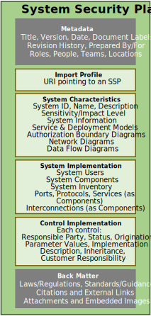

## Purpose

The OSCAL system security plan (SSP) model represents a description of the control implementation of an information system. The SSP model is part of the OSCAL [implementation](../) layer.

The OSCAL SSP model enables full modeling of highly granular SSP content, including points of contact, system characteristics, and control satisfaction descriptions. At a more detailed level, this includes the system's authorization boundary, information types and categorization, inventory, and attachments. In terms of control satisfaction, it models control parameter values, responsible roles, implementation status, control origination, and a description of control satisfaction at a level of granularity down to a specific control statement. Control satisfaction can be defined for the system as a whole or for individual implemented components.

## Concepts

Component definition model concepts are described in [concepts](../../concepts/#system-security-plan-model-concepts).

## Authors and Consumers

### SSP Authors

<table><tr><td style="background-color:#cccccc; border:none">
System Owners and System Security Plan Authors
</td></tr></table>

Through delegation, system owners create and maintain SSP content to document the implementation of controls within their system.

### SSP Consumers

<table><tr><td style="background-color:#cccccc; border:none">
Assessors, Customers, Authorizing Officials, Leveraging System Owners
</td></tr></table>

Assessors consume SSPs in the planning and execution of a system assessment relative to an established control baseline and compliance framework. 
Authorizing Officials consume SSPs in the adjudication of a system as part of approving an authorization to operate.

##  SSP Organization

{}
{}
{}
&nbsp;

{}
{}
An OSCAL profile is organized as follows:
- **Metadata**: Metadata syntax is identical and required in all OSCAL models. It includes information such as the file's title, publication  version, publicaiton date, and OSCAL version. Metadata is also used to define roles, parties (people, teams and organizations), and locations.
- **Import Profile**: Identifies the applicable control baseline for the system.
- **System Characteristics**: Represents attributes of the system, such as its name, description, models, and information processed.
- **System Implementaiton**: Represents relevant information about the system's deployment, including user roles, interconnections, services, and system inventory. 
- **Control Implementaiton**: Describes how each control in the baseline is implemented within the system. 
- **Back Matter**: Back matter syntax is identical in all OSCAL models. It is used for attachments, citations, and embedded  content such as graphics. 
{}
{}

{}

## Content Examples

Multiple examples of SSP expressed using the OSCAL SSP model can be found in the OSCAL GitHub repository in multiple formats:

[XML](https://github.com/usnistgov/oscal-content/tree/master/ssp-example/xml)&nbsp;&nbsp;&nbsp;
[JSON](https://github.com/usnistgov/oscal-content/tree/master/ssp-example/json)&nbsp;&nbsp;&nbsp;
[YAML](https://github.com/usnistgov/oscal-content/tree/master/ssp-example/yaml/)
