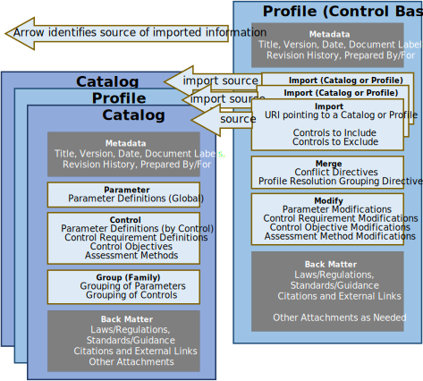

## Purpose

The OSCAL Profile model represents a [baseline](../../../concepts/#baseline) of selected [controls](../../../concepts/#control) from one or more control [catalogs](../../../concepts/#catalog), which is referred to as a "profile" in OSCAL. The Profile model is the sole model in the OSCAL [Profile](../) layer.

## Authors and Consumers

### Profile Authors

Control Baseline Authors, Authorizing Officials, and System Owners

Profiles are authored by an organization that defines or governs control baselines, such as the High, Moderate, and Low baselines defined for NIST's Special Publication (SP) 800-53 controls.

Organizations may also author a profiles when they need to define or tailor a set of controls applicable to their organization. 

Finally, system owners or authorizing officials may author profiles to establish a baseline of tailored controls applicable to a specific system.

### Profile Consumers

System Security Plan Authors and Consumers, Auditors, Authorizing Officials and Component Definition Authors and Consumers

Profiles are consumed by system owners and authorizing officials as the basis for the [System Security Plan](../../implementation-layer/ssp/) (SSP).

An auditor uses a profile to assess a system in the context of its control baseline.

[Component definition](../../implementation-layer/component/) authors may use profiles to establish context for how a component could satisfy a control requirement.

## Model Overview

{}
{}
{}
An OSCAL profile is organized as follows:

- **Metadata**: Metadata syntax is identical and required in all OSCAL models. It includes information such as the file's title, publication version, publication date, and OSCAL version. Metadata is also used to define roles, parties (people, teams and organizations), and locations.
- **Import**: Identifies an OSCAL [catalog](../../catalog-layer/) or other profile from which controls are to be imported. A control must be imported to be included in a baseline. All parameters and back-matter resources cited by an imported control are also imported.
- **Merge**: Provides directives as to how controls should be organized. It also provides directives for resolving conflicts where two or more variations of a control are imported as a result of multiple import statements.
- **Modify**: Provides the ability to tailor imported controls, including their parameters, control requirement definitions, references, control objectives, and assessment actions. 
- **Back Matter**: Back matter syntax is identical in all OSCAL models. It is used for attachments, citations, and embedded content such as graphics. 
{}
{}

{}
{}
{}

## Key Concepts

OSCAL profiles define a set of operations that are to be performed on one or more control catalogs to sufficiently reduce and tailor the catalog for use as a system implementation baseline. As such, an OSCAL profile can be thought of as change lists or punch lists referencing one or more catalogs, defining any or all of the following:

* Which controls are *selected* from the catalog and thereby considered to be in scope for the application;
* How the control selection should be *organized* and represented, including whether and how competing control definitions are to be resolved and merged;
* Whether and where any controls are to be *configured* or modified; this includes setting parameter values for a catalog but also potentially amending the language given in controls to describe their application in the system.

See [examples](#content-examples) of OSCAL profiles.

These three functions are reflected in the organization of a profile document, which may contain (in addition to document metadata) any of three sections, `import`, `merge`, and `modify`:

* `import` (required) - indicates which controls to include or exclude from catalogs
* `merge` - what merge rules to follow and how to organize outputs
* `modify` - how to configure and/or modify parameters and control languages (statements, guidance etc.)

The figure below expresses represents the portion of the OSCAL stack as it relates to an OSCAL profile.

## Content Examples

Multiple examples of baselines expressed using the OSCAL profile model can be found in the OSCAL GitHub repository in multiple formats:

| Source | Formats |
|:---|:---|
| NIST SP 800-53 rev 5 | \[[XML](https://github.com/usnistgov/OSCAL-content/blob/master/nist.gov/SP800-53/rev5/xml/)\] \[[JSON](https://github.com/usnistgov/OSCAL-content/blob/master/nist.gov/SP800-53/rev5/json/)\] \[[YAML](https://github.com/usnistgov/OSCAL-content/blob/master/nist.gov/SP800-53/rev5/yaml/)\]
| NIST SP 800-53 rev 4 | \[[XML](https://github.com/usnistgov/OSCAL-content/blob/master/nist.gov/SP800-53/rev4/xml/)\] \[[JSON](https://github.com/usnistgov/OSCAL-content/blob/master/nist.gov/SP800-53/rev4/json/)\] \[[YAML](https://github.com/usnistgov/OSCAL-content/blob/master/nist.gov/SP800-53/rev4/yaml/)\]
| FedRAMP Baselines | \[[XML](https://github.com/gsa/fedramp-automation/blob/master/baselines/xml/)\] \[[JSON](https://github.com/gsa/fedramp-automation/blob/master/baselines/json/)\] \[[YAML](https://github.com/gsa/fedramp-automation/blob/master/baselines/yaml/)\]

You will also find the "resolved" version of each profile. These files end with the suffix `-resolved-profile_catalog` to indicate that the profile [resolution process](/documentation/processing/profile-resolution/) has been performed to generate a catalog containing only the selected and tailored controls defined by the profile.