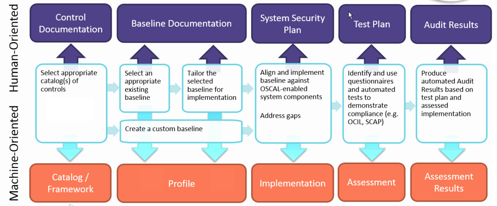

# OSCAL Overview

Before explaining what OSCAL is, it is important to define three key OSCAL terms:

* *Control*: A safeguard or countermeasure designed to satisfy a set of defined security and/or privacy requirements. While this is based on the NIST Special Publication (SP) 800-53 definition of "control", in the context of OSCAL it refers to a similar kind of requirement from a control catalog.
* *Catalog*: A set of security control definitions. Examples include the hundreds of controls in NIST SP 800-53 Revision 4 Appendix F, the 100+ controls in ISO 27002, and the practices in COBIT 5.
* *Profile*: A set of security requirements, where meeting each requirement necessitates implementing one or more security controls. Also called a baseline or overlay. Examples include the control baselines in NIST SP 800-53, the FedRAMP baselines, and the PCI DSS requirements.

## The purpose of OSCAL

OSCAL is attempting to address a number of challenges around security controls and security control assessment. The core challenge, and one of the primary reasons for creating OSCAL, is that concepts like security controls and profiles are represented today largely in proprietary ways. In many cases they are written in prose documents that are imprecise, lead to differences in interpretation, and are not machine-readable, meaning that the prose instructions require someone to do data entry into a tool in order for the tool to use the information. 

Organizations are also struggling with information systems that have many different components. Some components require the use of different profiles per component; this is commonly the case with cloud environments. Also, cloud environments can be multitenant or have mixed ownership of components. We need to be able to assess the security of these systems against a number of requirements, owners, etc.—to do that simultaneously and provide these views to stakeholders. 

On top of that there are situations where a single system needs to support multiple regulatory frameworks. For example, the U.S. Department of Veterans Affairs is a federal agency (Federal Information Security Modernization Act (FISMA) and NIST Cybersecurity Framework requirements) and a healthcare institution (Health Insurance Portability and Accountability Act (HIPAA) requirements) that has credit card transactions (Payment Card Industry Data Security Standard (PCI DSS)). There is no shortage of requirements for some organizations that have multiple regulatory frameworks. 

Assessing all these security controls is extremely complex. Because of that complexity, it’s largely a manual process today. The OSCAL project is trying to change that by standardizing how security controls are represented, how a control implementation for a given system is represented, and how that information is best used and reports generated in a standardized way that can be used by both humans and machines. That means formats are needed that can be generated by machines for communicating with other machines, but can also easily be reformatted so humans can read the information. By standardizing the representation of this information, OSCAL information can be interoperable by having a well-defined specification with information that’s going to be used, imported, and used interoperably for security control assessments. The goal is to keep OSCAL as simple as possible and provide extensive automation for tools to use.

## Types of OSCAL users

The initial OSCAL work encompasses the catalog and profile concepts. There are several types of users who should benefit from OSCAL catalogs and profiles. They include the following producers of OSCAL catalogs, profiles, and/or tools:

* *Catalog maintainers*: publishing catalogs into OSCAL format (e.g., NIST, ISO, ISACA)
* *Standard profile maintainers*: profiles in OSCAL format used by many organizations consuming OSCAL catalogs (e.g., NIST, FedRAMP)
* *Custom profile maintainers*: developing new profiles or customizing existing profiles for organization-specific use (e.g., cloud service providers, integrators)
* *Tool vendors*: creating tools that use OSCAL to support risk assessment, continuous monitoring, compliance reporting, and other purposes

There are also several types of expected consumers of OSCAL catalogs, profiles, and/or tools, including the following:

* *Operations personnel*: rapidly verifying that systems comply with organizational security requirements
* *Security and privacy personnel*: automatically identifying problems and addressing them quickly before loss or damage occur
* *Auditors/assessors*: performing audits/assessments on demand with minimal effort
* *Policy personnel*: identifying systemic problems that necessitate changes to organization security policy

## OSCAL components and high-level architecture

The plans for OSCAL involve all the components depicted in the following diagram:

Starting from the bottom on the left, the OSCAL components are:

* *Catalog/Framework*: In addition to defining a set of security controls, it may also define objectives and methods for assessing the controls (e.g., NIST SP 800-53A). Combining assessment objectives and methods with security controls has been done because some control catalog formats, such as COBIT 5, address assessment information directly. Others have it separately, like 800-53A. Including assessment objectives within the OSCAL catalog model simplifies the entire OSCAL operational model.
* *Profile*: The profile format will allow for selecting security controls using a number of different mechanisms as well as tailoring those controls (e.g., assigning parameter values, modifying requirements). A profile can include controls from more than one catalog, so an organization could have a single profile that references controls from several catalogs.
* *Implementation*: Defines how each profile item is implemented for a given system component. This can represent a machine-readable system security plan in OSCAL format. It will also support transforms from the machine-readable form to a human-readable version.
* *Assessment*: Describes how the system assessment is to be performed.
* *Assessment Results*: Records the findings of the assessment.

These are the current definitions for each component. As the project progresses, these definitions may evolve. They are included here to indicate the overall body of work for OSCAL and not the finalized details of each component.
